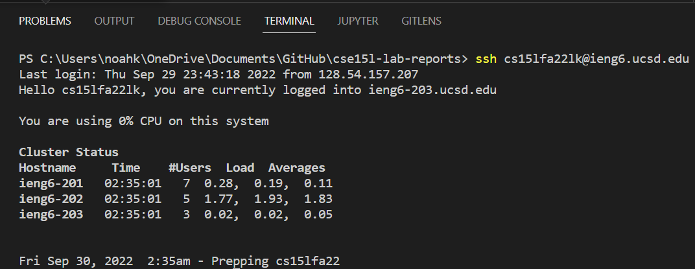

# Week 1 Lab Report
Welcome to my Week 1 lab report! This page is a comprehensive tutorial that will walk you through the steps needed to log you into your course-specific **ieng6** account.
<br />
<br />

### 1) Installing VScode 
 
Visual Studio Code is the recommended IDE for this course. Go to  https://code.visualstudio.com/ and follow the steps on the site to install the program.\
Make sure to choose the right installer for your operating system, as a Windows installer won't work on Mac (and vice versa).


 VScode landing page

 \
What you should see on startup

  <br />
  <br />

### 2) Remotely Connecting
Make sure you install the OpenSSH client if you don't already have it. \
Create a new file in any folder called WhereAmI.java, then navigate to "Terminal" -> "New Terminal" using the toolbar up top. \
Here, you can use the ssh command like so in order to log in to your remote server using your account name and password (get your account name and password [here](https://sdacs.ucsd.edu/~icc/index.php), I don't input a password because a later step allows you do skip doing so):


What your terminal should look like after sucessfully connecting 

<br />
<br />

### 3) Trying Some Commands
Feel free to run some commands on your remote server in order to get a feel for things. \
Common commands include cd, ls, cp, and cat; refer to [this](https://dyclassroom.com/reference-linux/linux-commands-working-with-files-and-directories) document if you need a guide handy. \
Logout of the remote server by typing "logout" once you're done.


 Commands being run on the terminal. We are printing the current directory, copying foo.txt to the test directory, then changing into the foo directory in order to check if the copy was successful.<

<br />
<br />

### 4) Moving Files with ```scp```
For this lab, make sure you copy the code shown in the image below into your WhereAmI.java file, and to download the JavaJDK [here](https://www.oracle.com/java/technologies/downloads/) in order to avoid any potential issuses. \
Next, compile and run your WhereAmI program by using ``javac WhereAmI.java`` and ``java WhereAmI`` in that order; what you should see is a list of information about your computer that will vary when used on your remote server.\
Finally, copy the file to your remote server using ``scp WhereAmI.java cs15lfa22zz@ieng6.ucsd.edu:~/``;


 What the WhereAmI program should output to terminal
<br/>


 Copying to remote server...


 Compiling and running WhereAmI on the server 
<br />
<br />

### 5) Setting an SSH Key
Enter the ``ssh-keygen`` command and follow the prompts: when asked to "enter file in which to save the key", copy the default path shown in the parenthesis and leave the passphrase blank when asked to do so.\
(If you are on Windows, you must follow the extra ``ssh-add`` step [here](https://docs.microsoft.com/en-us/windows-server/administration/openssh/openssh_keymanagement#user-key-generation) in order to get things working properly. Follow the 2nd image below if you need extra guidance.)\
Finally, log into your remote server and type ``mkdir .ssh`` into the terminal, which should allow you to finally log into the remote server / copy files with no password!


 The process of setting up your ssh keygen... 
<br/>


 OPTIONAL Windows-only ssh-add step. Make sure to cd to the directory holding your ssh key. 
<br/>


 Smooth log-in once our ssh key is setup! 

<br />
<br />

### 6) Optimizing Remote Running
There are some tricks you can use in order to minimize your keystrokes when working on a project, such as using semi-colons (;) to run multiple commands or using a command in quotes ("ls") with an ssh command in order to run the command directly off of the server. \
Input the commands as shown below, replacing the file names and account names as needed. \
For this specific example, all you need to do is press the "up" key in order to copy a file to the remote server and run it in only a few keystrokes! (Up key mileage may vary based on how many commands you plan on running in between)\
\

 Commands needed to copy and run WhereAmI on the server all in one line, easily accessible by the up key.
<br />
<br />

---

<br />
<br />

## ~End of guide~


