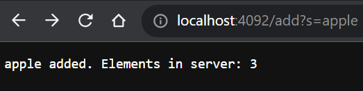

# Week 3 Lab Report
Welcome to my Week 3 lab report! Here I will showcase my simple search engine implementation, and the input / symptoms of the bugs provided in our lab code.
<br />
<br />
<br/>
## Part 1: Simplest Search Engine
---
### Simplest Search Engine implementation
```
import java.io.IOException;
import java.net.URI;
import java.util.ArrayList;

class SearchHandler implements URLHandler {
    ArrayList<String> words = new ArrayList<String>();
    public String handleRequest(URI url) {
        if (url.getPath().equals("/")) {
            return "Welcome to my search engine! Use add?s= to add a new word and search?s= to search for all added words.";
        }
            System.out.println("Path: " + url.getPath());

            if (url.getPath().contains("/add")) {
                String[] parameters = url.getQuery().split("=");
                if (parameters[0].equals("s")) {
                    words.add(parameters[1]);
                    return parameters[1] + " added. Elements in server: " + words.size();
                }
            }

             if (url.getPath().contains("/search")) {
                String[] parameters = url.getQuery().split("=");
                String anOutput = "Your search result is: ";
                int strLen = anOutput.length();
                if (parameters[0].equals("s")) {
                    String search = parameters[1];
                    for (int i = 0; i < words.size(); i++) {
                            if (words.get(i).indexOf(search) > -1) {
                                anOutput += words.get(i);
                                anOutput = anOutput.concat(" and ");
                            } 

                    }
                    if (anOutput.length() > strLen) {
                        anOutput = anOutput.substring(0, anOutput.length()-4);
                    }
                    return anOutput;
                }
            }
            return "404 Not Found!";
    
        }
    }

class SearchEngine {

        public static void main(String[] args) throws IOException {
            if(args.length == 0){
                System.out.println("Missing port number! Try any number between 1024 to 49151");
                return;
            }
    
            int port = Integer.parseInt(args[0]);
    
            Server.start(port, new SearchHandler());
        }
    
}
```
</br>
</br>

### Screenshot #1: Default landing page
---


**Methods being called**: handleRequest(), getPath(), equals()\
handleRequest() takes in an argument of type URI in order to perform operations, getPath() returns the path of the URI object as a String, and equals() compares the equivalency of the argument to the object that is calling it.

**Value of method arguments**: \
handleRequest() = url. As mentioned above, it takes an object of type URI and eventually returns a string based on the parsed information. \
equals() = "/". We are checking to see if the URI object's path contains a "/".\
There is also an empty String ArrayList that never gets modified in this case.

**Do any values change?**: \
These values do not change by the time the request is processed.

</br>
</br>
### Screenshot(s) #2: Adding words to the server

---




**Methods being called**: handleRequest(), getPath(), equals(), contains(), getQuery(), split(), add(), size()\
The usage of handleRequest(), getPath(), and equals() remains the same (though equals is used one additional time here). Contains is used to check if the URI object's path contains "/add". getQuery() is used to return the query component of the URI object. split() is used to split the string based on the given expression. add() is used to append an element onto our ArrayList. size() is used to check the number of elements in the given ArrayList.

**Value of method arguments:** \
handleRequest() = url, as before.\
equals() = "/", as before. However, the 2nd equals() = "s" in order to check if the right keyword is being used for adding a word to the search engine. \
contains () = "/add". Used to check if the path being returned contains the "/add keyword.\
split() = "=". Splits the query string if a "=" is found. This allows keyword "s" and the user input to be separated into different indexes. \
add() = parameters[1]. adds the user's input into the words ArrayList.

**Do any values change?** \
The words ArrayList gets an extra initialized element (value) everytime the add operation succeeds. The values in parameters[0] and [1] are created and initialized with potentially new elements for every request.

</br>
</br>

### Screenshot(s) #3: Searching server for words

---


**Methods being called**: handleRequest(), getPath(), equals(), contains(), getQuery(), split(), size(), length(), indexOf(), get(), concat(), substring()\
The usage of handleRequest(), getPath(), and equals(), contains(), getQuery(), split(), and size() remain the same. However, contains() is used an additional time here after the first contains() check returns false.\
length() is used to check the number of characters in the string(); in this case, it is used to ensure that the length of the string has changed. \
indexOf() simply returns the index of the element that matches the argument. If not found, -1 will be returned.\
get() is used to return the value at a given index.\
concat() is used to concatenate additional characters onto a string.\
substring() is used to return a substring of the given string based on the set range. For example, substring(0, 4) on the word "apple" will return "appl".


**Value of method arguments:** \
handleRequest() = url, as before.\
contains () = "/add", as before. However, contains() is used a second time here in order to check for "/contains" due to the first contains() returning false.
equals() = "/", as before. The second equals checks "s", also as before.\
split() = "=", as before.\
get() = i (our for loop's index). gets the value at index i.\
indexOf() = search, where search is equivalent to parameters[1]. Checks for the index of a value matching the argument, and returns -1 if not found.\
concat() = " add ", which concatenates " and " onto the output string.\
substring() = (0, anOutput.length() - 4). Due to my decision to format the output with an " add " after every word, I use the substring method in order to remove the " and " from the last word.

**Do any values change?** \
As before, the values in parameters[0] and [1] are created and initialized with potentially new elements for every request. The output of the initialized string anOutput can also change depending on the elements held in the words ArrayList.

</br>
</br>
</br>

## Part 2: Inputs, Symptoms, Bugs, and Fixes
---
### Problem #1: ArrayExamples's reversed() method

**The failure-inducing input:**\

The custom test fails because the reversal swaps elements incorrectly.
</br>

**The symptom:**

The value of all indexes in newArray[] are 0, resulting in the reversal failing.

**The bug, and the fix**:


The method that is commented out is the original implementation. To reiterate, the bug here is that we are simply initializing an array of size arr.length without actually initializing the value of the indexes, leading to an array of {0,0,...}. I fixed it by instead copying from arr[] to newArray[], rather than the other way around (which makes much more sense.)

**Symptom and bug relationship**:\
The bug that utilizes an array filled with zeroes causes this program fail outside two very specific inputs: an empty array, and an array filled with zeroes. This bug causes this particular symptom due to the fact that an array of non-zeroes will never be equivalent to an array of only zeroes, and this holds true for all arrays that are not empty or filled with non-zeroes.

</br>
</br>

### Problem #2: ListExamples' filter() method

**The failure-inducing input:**\

The non-empty test fails because the code will always add at index 0, leading to a prepend to the front rather than an append to the back.


**The symptom:**

The output is in the reverse order due to the issue mentioned above -- prepending elements.

**The bug, and the fix**:


The method that is commented out is the original implementation. To reiterate, the bug here is that we are adding to the array at index 0 for all elements. As a result, we get an array that is in a reversed order due to the fact that we are adding to the front (prepending) instead of the back (appending).

**Symptom and bug relationship**:\
The bug that causes the method to always add elements to the front means that this method fails outside of some very specific inputs: 1) an empty listArray. 2) an input with only 1 element. 3) an input that leads to the filter removing all or all but one element. This bug causes this particular symptom due to the fact that a reversed filtered arrayList will never be equivalent to our expected output of a filtered arrayList in the same order -- and this holds true for all inputs outside of the 3 outlined above.\


---
## ~End of Report~
 
