# Week 7 Lab Report
Welcome to my Week 7 lab report! Here I will showcase the best way I came up with in order to change the main mthod to take a command-line argument, then time the difference between scp-ing a file and simply just editing directly with vim. 
## 1) Part 1: Changing the main method

### The full sequence:
 `/ t e c <Enter> n b c % ( a r g s [ 1 ] ) <Esc> : w <Enter>`
### Sequence with screenshots (starts on next page in PDF format):

1) File when opened. No keystrokes.\
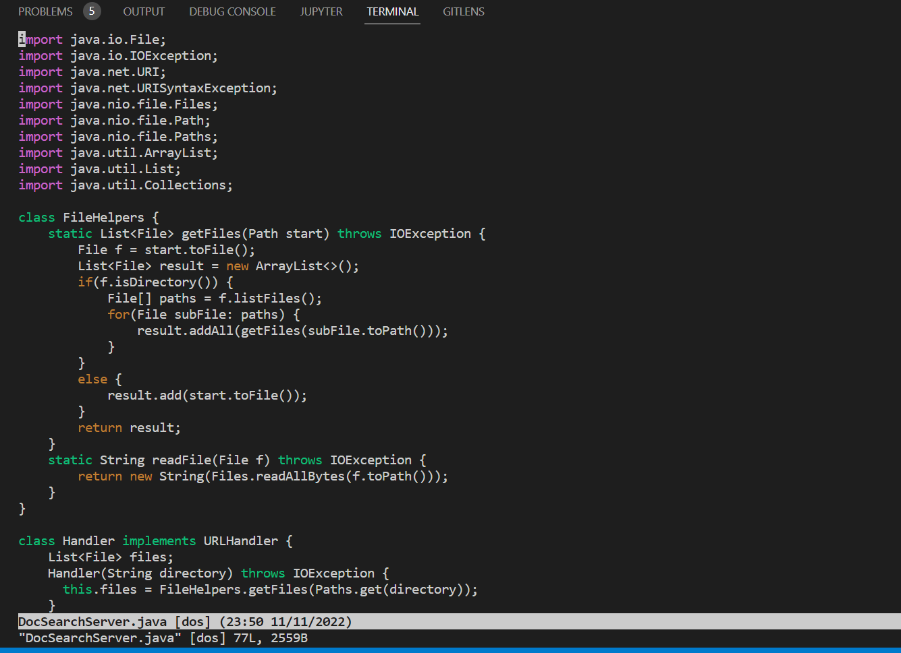

 

2) Searching for keyword. Keystrokes: `/ t e c`
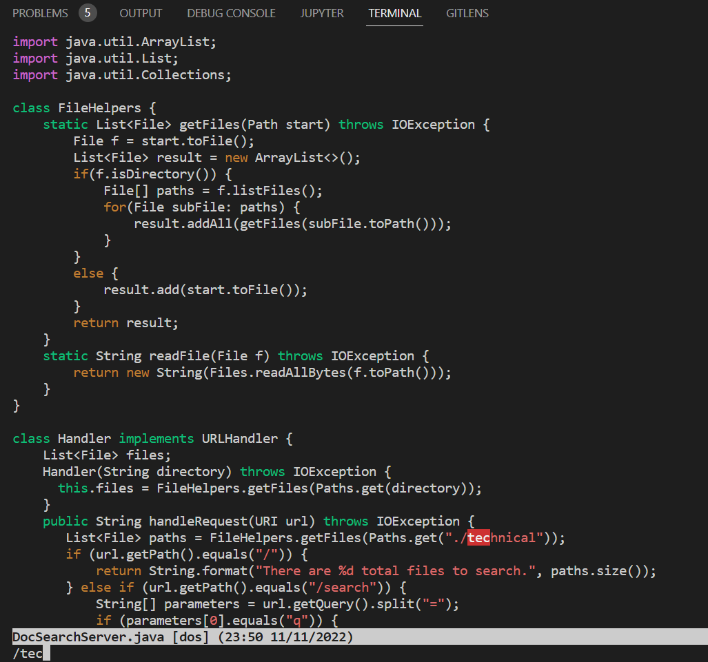

 

3) Jumping to matched word. Keystrokes: `<Enter>`
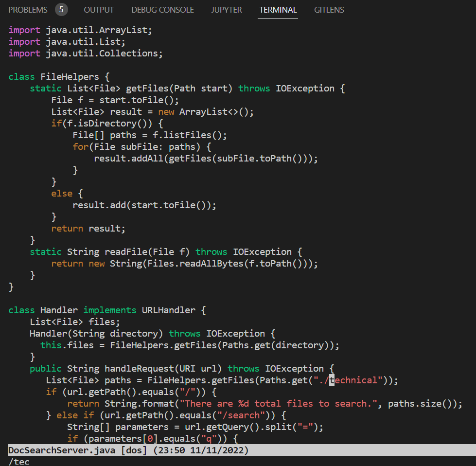

 

4) Jumping to next matched word. Keystrokes: `n`
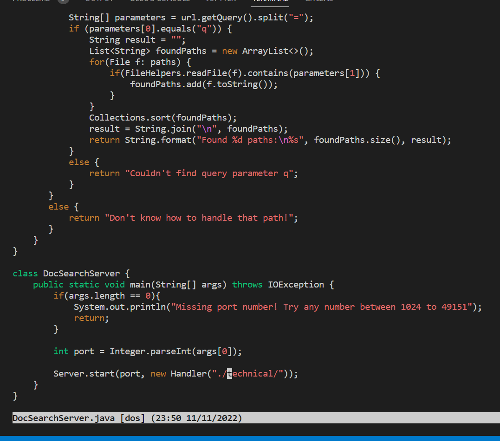

 

5) Going back a word. Keystrokes: `b`
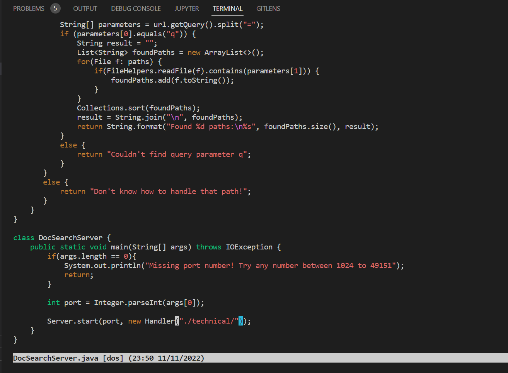

 

6) Replacing everything between the parenthesis. Keystrokes: `c %`
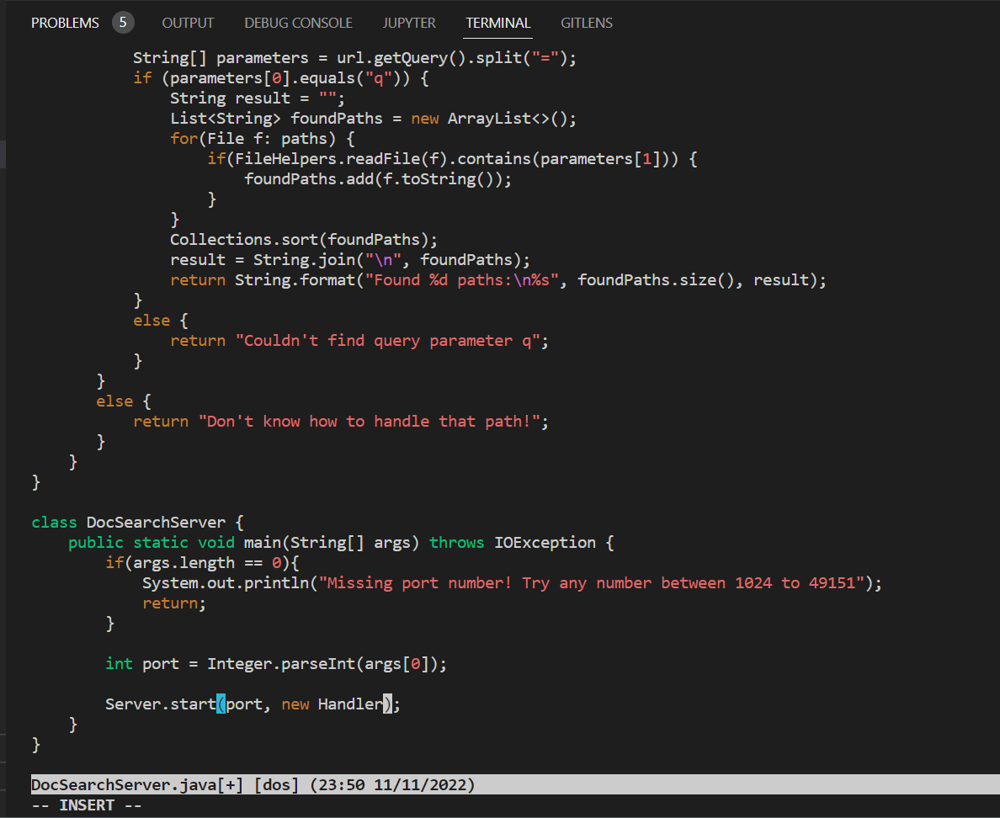

 

7) Appending onto "Handler" so that main takes 2nd command line arg. Keystrokes: `( a r g s [ 1 ] )`
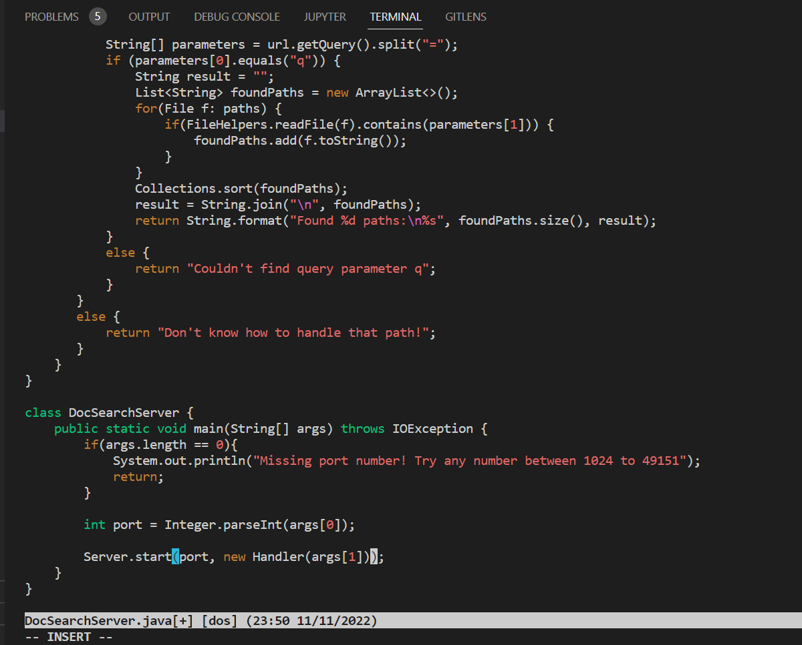

 

8) Exiting insert mode. Keystrokes: `<Esc>`
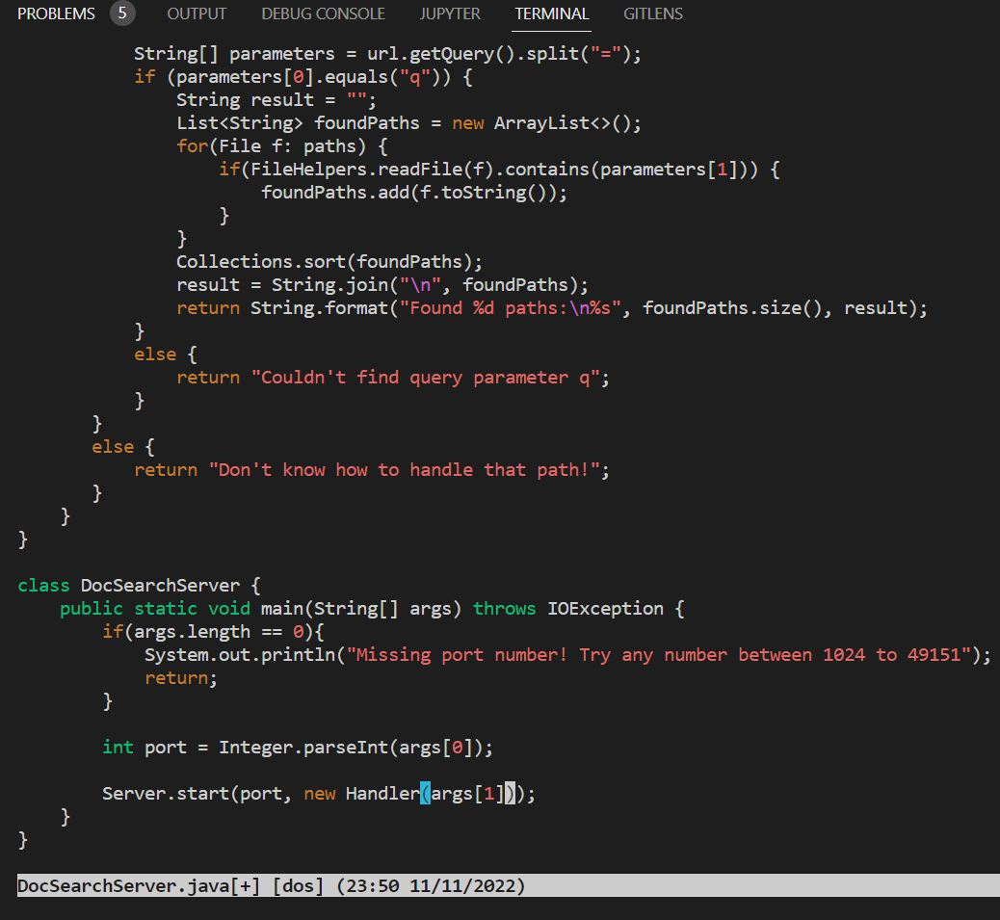

 

9) Entering command to save changes. Keystrokes: `: w `
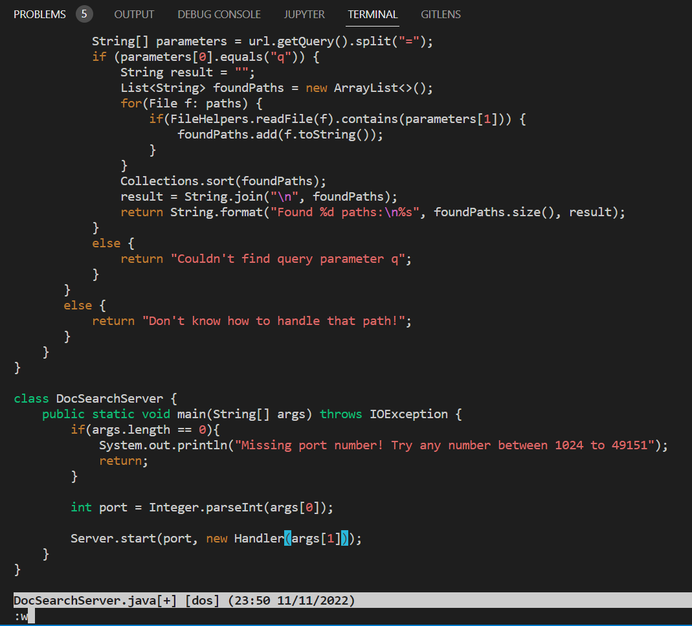

 

10) Saving changes. Keystrokes: `<Enter>`
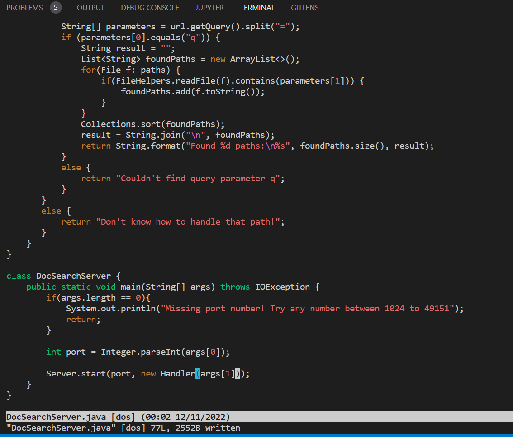

 
 

## 2) Part 2: scp vs vim 

**Test 1: Editing locally then scping to remote**
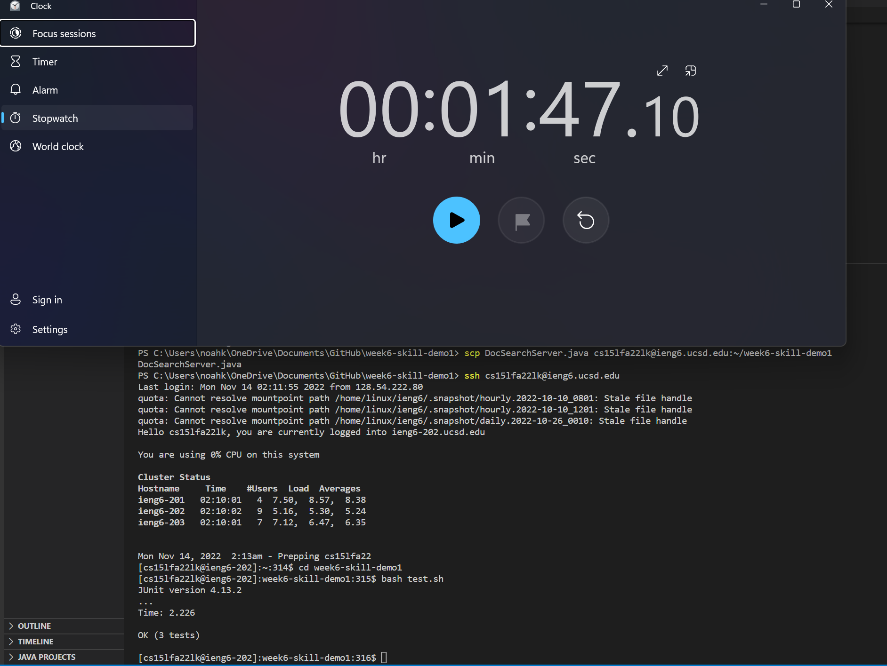

**Difficulties / details:** Besides some user errors, there weren't many difficulties using this method. Before even testing the vim method, however, it was noticeably slower due to the additional scp command and log-in.

 

**Test 2: Using vim while already logged in remotely**
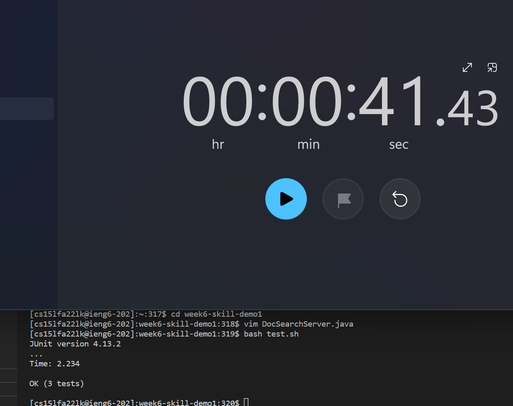

**Difficulties / details:** No difficulties now that I knew the steps needed to make the changes. Being able to skip the process of using the scp and ssh command definitely sped things up as well, on top of the increased familiarity with the process.

 
 

### Q & A

Q: Which of these two styles would you prefer using if you had to work on a program that you were running remotely, and why?\
A: When making smaller changes on a program remotely, I would definitely choose the vim method. However, it can be hard to give up the convenience of modern IDEs such as VS code when working on larger projects. Of course, I wouldn't have any choice but to use vim if my only access to the program was via remote connection.

 

Q: What about the project or task might factor into your decision one way or another? (If nothing would affect your decision, say so and why!)\
A: I think the biggest factors in my decision between the two are the scope of the program and its accessibility. If I expect to work on a large assignment with several files, I would likely choose to work remotely on a more familiar IDE with a debugger if at all possible. This may be due to a lack of experience, however. Otherwise, editing smaller projects with vim remotely would be more convenient, especially if I had no choice to work locally. I may choose to move to vim entirely with enough experience...