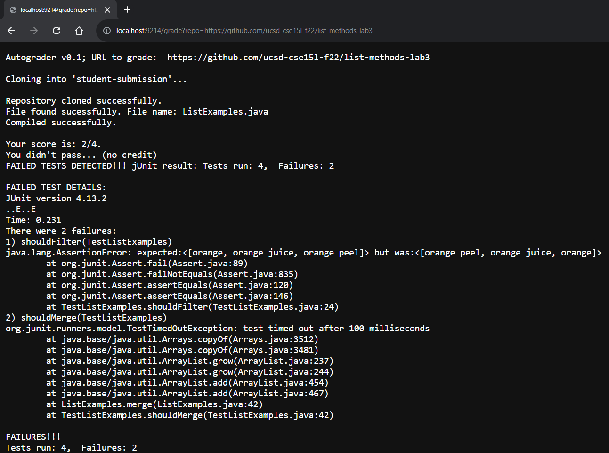
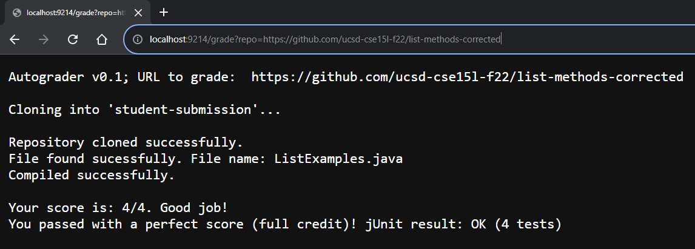
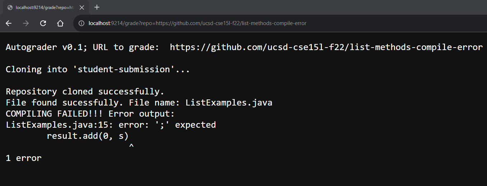

# Week 9 Lab Report
Welcome to my Week 9 Lab Report! Here I will showcase my bash grading script, its usage on three distinct "student submissions", and an in-depth trace of my grade.sh.


<br/>

---

## Part 1: My grading script (w/ line numbers)
```
1. WINDOWSCOMP=".;../lib/hamcrest-core-1.3.jar;../lib/junit-4.13.2.jar"
2.
3. echo "Autograder v0.1; URL to grade: " $1
4. echo ""
5.
6. rm -rf student-submission
7. git clone $1 student-submission 
8. let ERR1=$?
9. echo ""
10. if [[ ERR1 -eq 0 ]]
11. then
12.   echo "Repository cloned successfully."
13. else
14.   echo "FAILED repository cloning!!!"
15.   exit 1
16. fi
17.
18. cd student-submission
19.
20. if [[ -f "ListExamples.java" ]]
21. then
22.   echo "File found sucessfully. File name: "ListExamples.java""
23. else
24.   echo "FAILED to find file!!! Expected file name: "ListExamples.java""
25.   exit 1
26. fi
27.
28. cp ../TestListExamples.java .
29. javac -cp $WINDOWSCOMP *.java 2> error.txt
30.
31. if [[ $? -eq 0 ]]
32. then
33.   echo "Compiled successfully."
34. else
35.   echo "COMPILING FAILED!!! Error output:"
36.   cat error.txt
37.   exit 1
38. fi
39. 
40. java -cp $WINDOWSCOMP org.junit.runner.JUnitCore TestListExamples > test_result.txt
41. let ERR2=$?
42. let VAR1=$(head -n 2 test_result.txt | tail -n 1 | grep -o "." | grep -c "E")
43. let VAR2=$(head -n 2 test_result.txt | tail -n 1 | grep -o "." | grep -c "\.")
44. let VAR3=($VAR2-$VAR1)
45. 
46. echo ""
47. if [[ $ERR2 -eq 0 ]]
48. then
49.   echo "Your score is: "$VAR2"/"$VAR2". Good job!"
50.   echo "You passed with a perfect score (full credit)! jUnit result: $(cat test_result.txt | grep "OK")"
51.   exit 0
52. else
53.   echo "Your score is: "$VAR3"/"$VAR2"."
54.   if [[ $VAR3 -lt $(($VAR2-1)) ]]
55.   then
56.   echo "You didn't pass... (no credit)"
57.   else
58.   echo "You passed! However, you didn't get a perfect score. (partial credit)"
59.   fi
60.   echo "FAILED TESTS DETECTED!!! jUnit result: $(cat test_result.txt | grep "Tests run":)"
61. fi
62. echo ""
63. echo "FAILED TEST DETAILS: " 
64. cat test_result.txt
```

<br/>

---

## Part 2: Screenshots of three different student submissions


<br/>


### Screenshot #1:

Repository link: 
https://github.com/ucsd-cse15l-f22/list-methods-lab3
<br/>
<br/>

### Screenshot #2:

Repository link:
https://github.com/ucsd-cse15l-f22/list-methods-corrected
<br/>
<br/>

### Screenshot #3:

Repository link:
https://github.com/ucsd-cse15l-f22/list-methods-compile-error

<br/>
<br/>

---

## Part 3: Tracing script during test
I will be tracing what my grading script does when run with the test shown in **screenshot #3**, which is the example that showcases a compile error. As outlined in the lab report instructions, the focus will be on commands and conditionals (if statements).\
Repository in question: https://github.com/ucsd-cse15l-f22/list-methods-compile-error

<br/>

`Line 3: echo "Autograder v0.1; URL to grade: " $1`\
Standard output: Autograder v0.1; URL to grade:  https://github.com/ucsd-cse15l-f22/list-methods-compile-error \
Standard error: (N/A)\
Return code: 0

`Line 4: echo ""`\
Standard output: (N/A)\
Standard error: (N/A)\
Return code: 0

`Line 6: rm -rf student-submission`\
Standard output: (N/A)\
Standard error: (N/A)\
Return code: 0

`Line 7: git clone $1 student-submission`\
Standard output: (N/A)\
Standard error: Cloning into 'student-submission'...\
Return code: 0

`Line 9: echo ""`\
Standard output: (N/A)\
Standard error: (N/A)\
Return code: 0

`Line 10: if [[ ERR1 -eq 0 ]]`\
Condition: true\
Reason: ERR1 is equal to the return code of line 7, which is 0. Thus the condition is true.

`Line 12: echo "Repository cloned successfully."`
Standard output: Repository cloned successfully.\
Standard error: (N/A)\
Return code: 0

`LINES THAT DO NOT GET EVALUATED: Lines 13-15`\
Reason: else statement and everything within it does not run because the initial condition did.

`Line 18: cd student-submission`\
Standard output: (N/A)\
Standard error: (N/A)\
Return code: 0

`Line 20: if [[ -f "ListExamples.java" ]]`\
Condition: true
Reason: A file with the name "ListExamples.java" exists within the copied repository. Thus the condition is true.

`Line 22: echo "File found sucessfully. File name: "ListExamples.java""`\
Standard output: File found sucessfully. File name: ListExamples.java\
Standard error: (N/A)\
Return code: 0

`LINES THAT DO NOT GET EVALUATED: Lines 23-25`\
Reason: else statement and everything within it does not run because the initial condition did.

`Line 28: cp ../TestListExamples.java .`\
Standard output: (N/A)\
Standard error: (N/A)\
Return code: 0

`Line 29: javac -cp $CP *.java 2> compile_error.txt`\
Standard output: (N/A)\
Standard error: (N/A)\
Return code: 1 

`Line 31: if [[ $? -eq 0 ]]`\
Condition: false
Reason: $? is equal to the return code of line 29, which is 1. And since 1 does not equal 0, the condition is false.

`LINES THAT DO NOT GET EVALUATED: Lines 32-33`\
Reason: The initial condition does not get evaluated because the condition of line 31 was false, meaning only the else statement will.

`Line 35: echo "COMPILING FAILED!!! Error output:"`\
Standard output: COMPILING FAILED!!! Error output:\
Standard error: (N/A)\
Return code: 0

`Line 36:  cat compile_error.txt`\
Standard output:\
 ListExamples.java:15: error: ';' expected\
    result.add(0, s)\
          ^\
1 error\
Standard error: (N/A)\
Return code: 0

`Line 37: exit 1`\
Standard output: (N/A)\
Standard error: (N/A)\
Return code: 0 (the return code of the command itself is 0).

`LINES THAT DO NOT GET EVALUATED: Lines 38-64`\
Reason: Due to the early exit caused by line 37, the script is ended prematurely and the rest of these lines do not get the chance to run.

<br/>
<br/>

## ~~ End of Lab Report 5 ~~